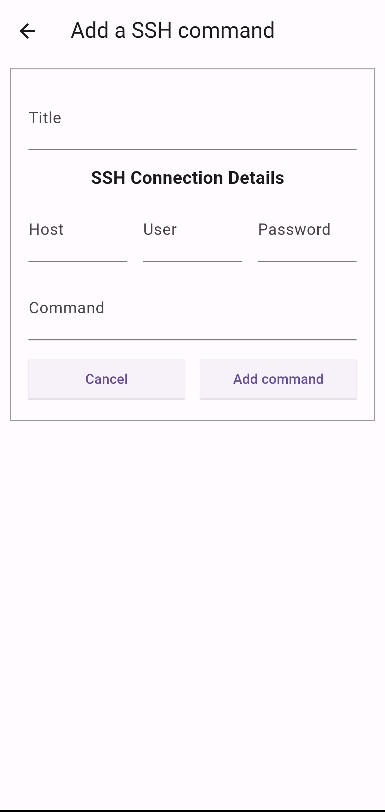

# SSH Commander

A Flutter application to send a single command to a server using SSH.

## Why did you make this
I didn't want to open an entire SSH session just to send a single SSH command, especially from my phone, so I made this app to send some common commands that I use.

## Screenshots
### The main screen 

### The add command screen

